# NG Signals AWS Deployment Runbook

This is a personal reference of the exact workflow used to build, deploy, and verify the `ng-signals` project on AWS for the first time.

## Final API Endpoint

- `https://9clpwaoipj.execute-api.us-east-1.amazonaws.com/api/v1/register`

---

## 1) Local Project and Dependency Setup

Run these commands in the order you used (some were exploratory and repeated during setup):

```bash
npx -p @angular/cli ng new ng-signals
git clone https://github.com/dahomost/ng-signals.git
npm install -D serverless serverless-offline
npm install @aws-sdk/client-dynamodb @aws-sdk/lib-dynamodb bcryptjs uuid
npm install @aws-sdk/client-dynamodb@3.632.0 @aws-sdk/lib-dynamodb@3.632.0
```

## 2) AWS CLI Authentication and Identity Check

```bash
aws configure
aws sts get-caller-identity
```

This confirms credentials and the active AWS account before deploy.

## 3) Serverless API Deploy (Lambda + API Gateway)

From backend folder:

```bash
cd back-end
npx serverless deploy
```

Useful commands used during testing/debugging:

```bash
npx serverless offline
npx serverless logs -f register -t
```

You also ran:

```bash
cd back-end && npx serverless deploy
```

## 4) Frontend Production Build

```bash
ng build --configuration production
```

Then you deployed static frontend files (S3 path used in your AWS flow).

## 5) Docker Workflow for Frontend

Commands used:

```bash
docker info
docker run hello-world
docker build -t ng-signals-frontend:latest
docker build -t ng-signals-frontend:latest .
docker run -p 8080:80 ng-signals-frontend:latest
docker tag ng-signals-frontend:latest 589833671815.dkr.ecr.us-east-1.amazonaws.com/ng-signals-frontend:latest
docker push 589833671815.dkr.ecr.us-east-1.amazonaws.com/ng-signals-frontend:latest
```

Recommended ECR login step before `docker push` (keep this for future runs):

```bash
aws ecr get-login-password --region us-east-1 | docker login --username AWS --password-stdin 589833671815.dkr.ecr.us-east-1.amazonaws.com
```

## 6) AWS Services You Used (Console)

- DynamoDB (`users` table)
- Lambda (`register`, `ng-signals-api-dev-register`, `ng-signals-api-dev-ping`)
- API Gateway (for `/api/v1/register`)
- ECR (frontend image registry)
- App Runner (frontend container hosting)
- S3 (static files + serverless deployment artifacts)

## 7) Quick Re-Deploy Checklist (Next Time)

### API changes

```bash
cd back-end
npx serverless deploy
npx serverless logs -f register -t
```

### Frontend changes with Docker + ECR + App Runner

```bash
docker build -t ng-signals-frontend:latest .
aws ecr get-login-password --region us-east-1 | docker login --username AWS --password-stdin 589833671815.dkr.ecr.us-east-1.amazonaws.com
docker tag ng-signals-frontend:latest 589833671815.dkr.ecr.us-east-1.amazonaws.com/ng-signals-frontend:latest
docker push 589833671815.dkr.ecr.us-east-1.amazonaws.com/ng-signals-frontend:latest
```

Then deploy/redeploy from App Runner.

---

## 8) Screenshot Evidence (from this setup)

### 8.1 Local project structure / setup context

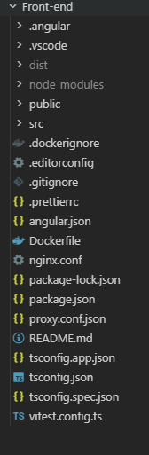

### 8.2 AWS console navigation

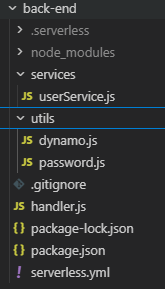

### 8.3 DynamoDB verification

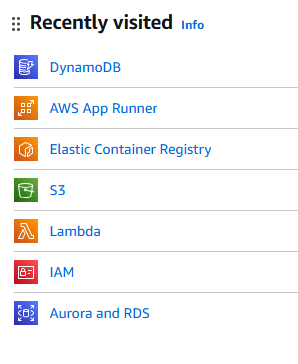

### 8.4 App Runner service

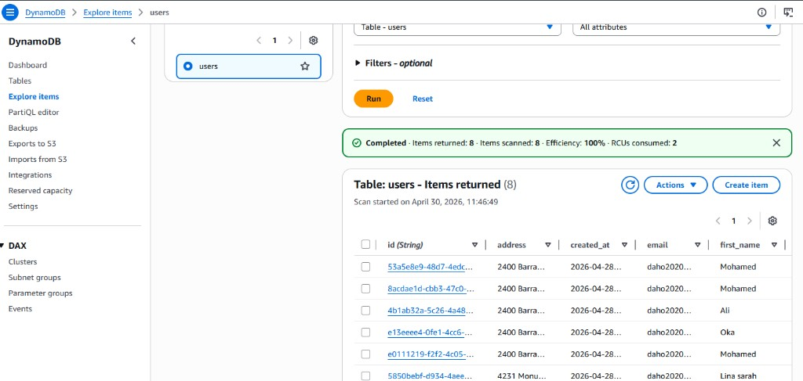

### 8.5 Frontend signup page

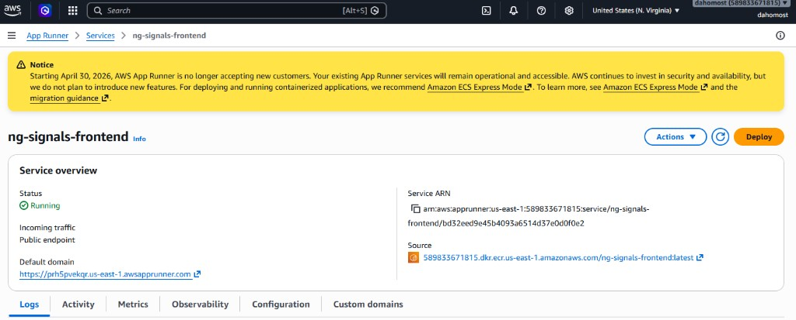

### 8.6 ECR repository

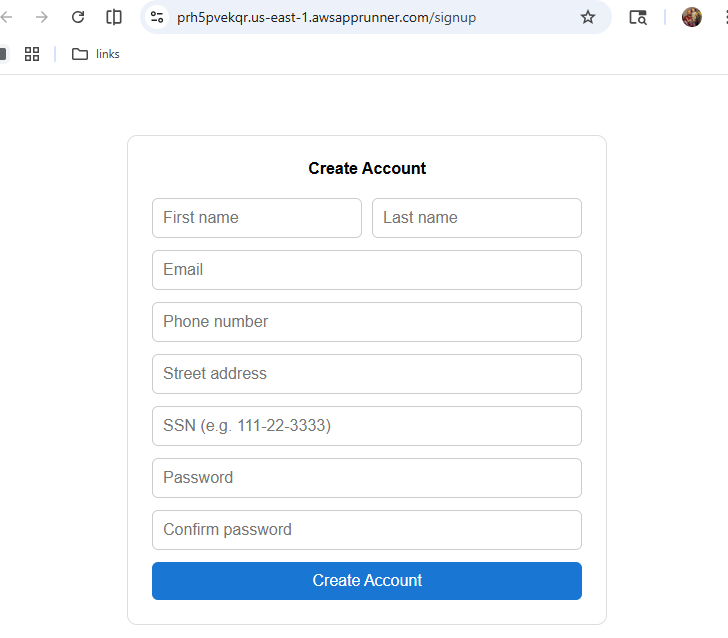

### 8.7 S3 buckets list

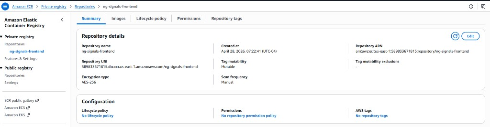

### 8.8 Frontend static files bucket

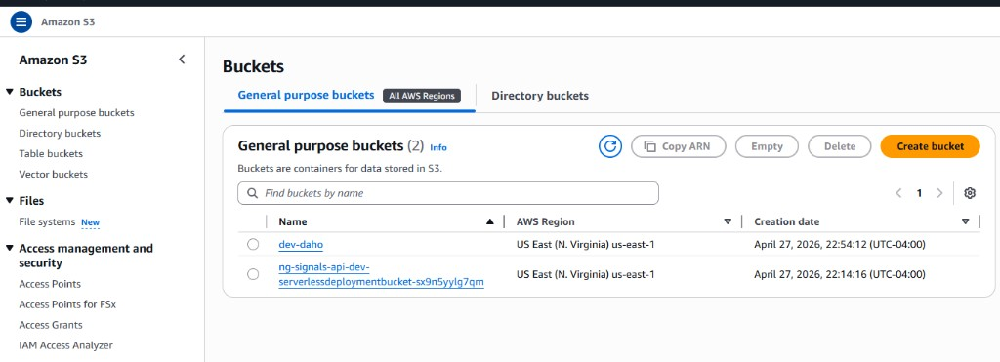

### 8.9 Serverless deployment bucket

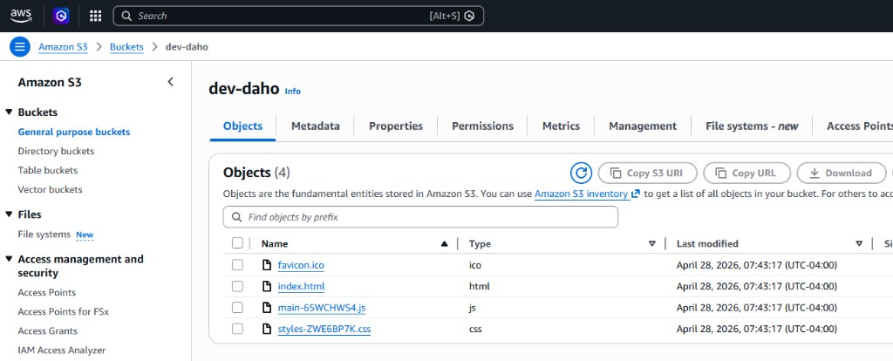

### 8.10 Serverless artifact folder in S3

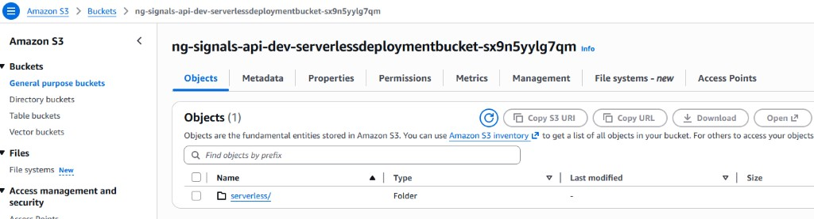

### 8.11 Lambda functions list

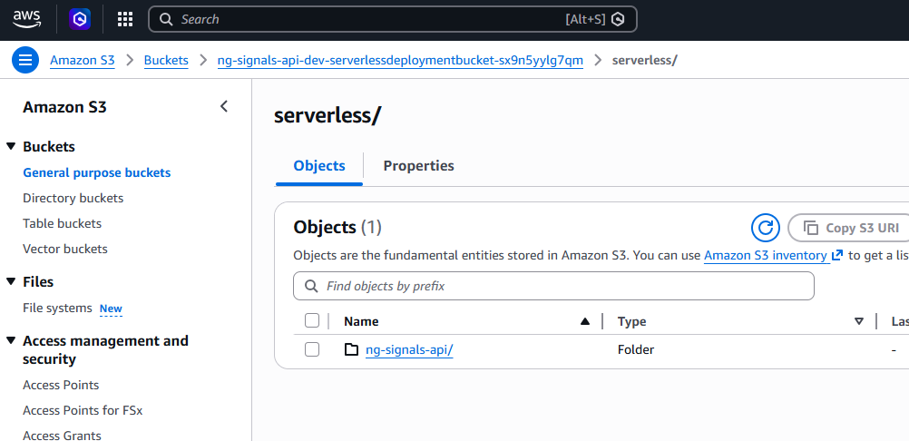

### 8.12 Lambda register function details

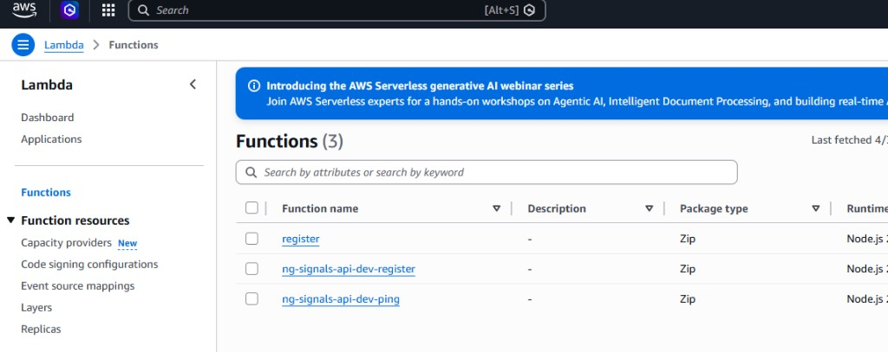

### 8.13 Backend/serverless source tree

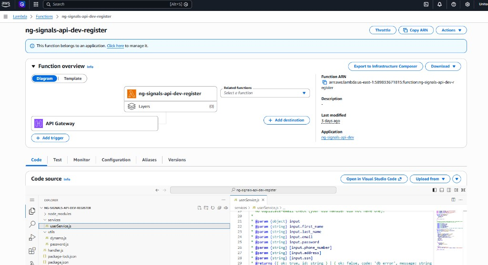

