# Spring Boot Backend Flow Summary

This document explains how the `back-end-spring/` folder works. It is the Java Spring Boot version of the registration API. It exposes REST endpoints, validates request bodies, hashes passwords, and saves users to DynamoDB through the AWS SDK for Java.

## Rendered Diagram

Use this image if Mermaid diagrams do not render in your Markdown preview:

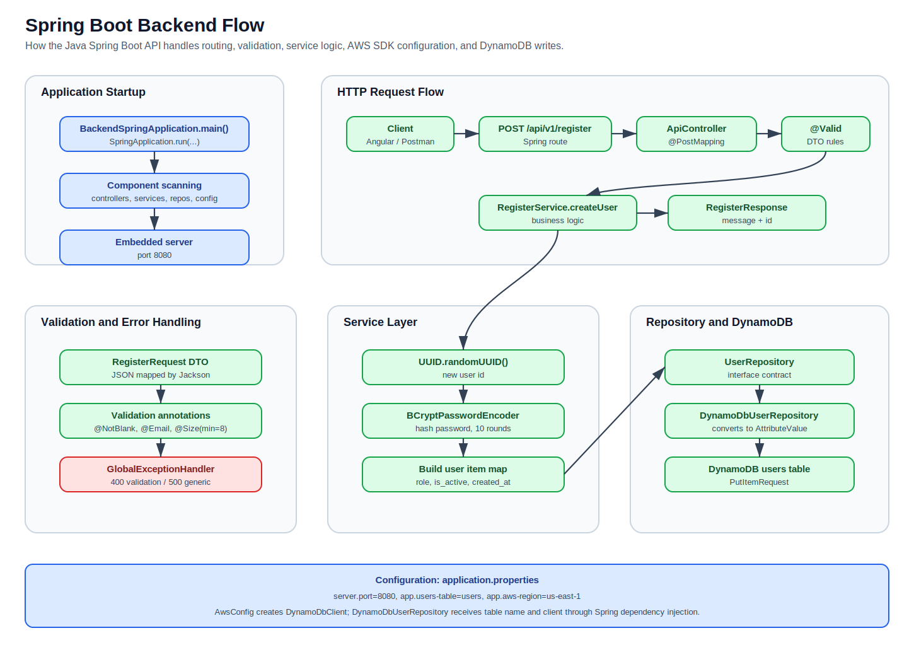

## Main Files

- `back-end-spring/pom.xml`: Maven project configuration and dependencies.
- `back-end-spring/src/main/resources/application.properties`: application port, DynamoDB table name, and AWS region.
- `BackendSpringApplication.java`: Spring Boot application entrypoint.
- `controller/ApiController.java`: REST endpoints for ping and register.
- `controller/GlobalExceptionHandler.java`: centralized error responses.
- `dto/RegisterRequest.java`: incoming register request model and validation rules.
- `dto/RegisterResponse.java`: successful register response model.
- `dto/PingResponse.java`: health-check response model.
- `dto/ErrorResponse.java`: error response model.
- `service/RegisterService.java`: registration business logic.
- `repository/UserRepository.java`: repository interface.
- `repository/DynamoDbUserRepository.java`: DynamoDB implementation.
- `config/AwsConfig.java`: AWS DynamoDB client configuration.

## Runtime Stack

- Java 17
- Spring Boot 3.5.0
- Spring Web
- Spring Validation
- Spring Security Crypto
- AWS SDK for Java v2
- DynamoDB
- Maven

## High-Level Request Flow

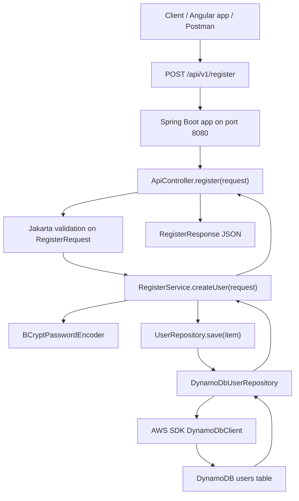

### Flow Explanation

1. A client sends a `POST` request to `/api/v1/register`.
2. Spring Boot receives the HTTP request on port `8080`.
3. `ApiController.register()` handles the route.
4. Spring converts the JSON request body into a `RegisterRequest` object.
5. `@Valid` triggers validation rules from `RegisterRequest`.
6. If validation passes, the controller calls `RegisterService.createUser()`.
7. The service generates a UUID and hashes the password with BCrypt.
8. The service builds a user item as a Java `Map`.
9. The repository converts the map to DynamoDB `AttributeValue` objects.
10. AWS SDK sends a `PutItemRequest` to the `users` table.
11. The controller returns `{ "message": "User created", "id": "<uuid>" }`.

## Application Startup Flow

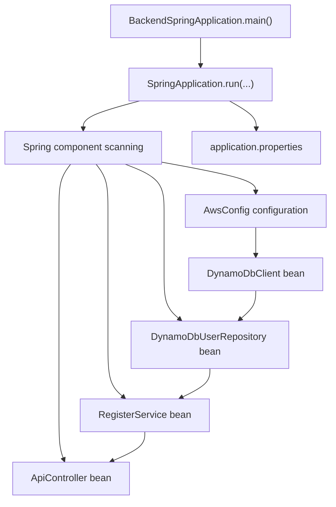

### Startup Explanation

`BackendSpringApplication.java` starts the application:

```java
SpringApplication.run(BackendSpringApplication.class, args);
```

Spring then scans the package and creates beans for:

- `ApiController`
- `RegisterService`
- `DynamoDbUserRepository`
- `AwsConfig`
- `DynamoDbClient`

Spring injects dependencies through constructors. For example, `ApiController` receives `RegisterService`, and `RegisterService` receives `UserRepository`.

## Endpoint Mapping Flow

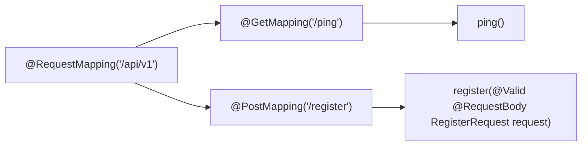

### Endpoints

The endpoints are defined in `ApiController.java`.

```text
GET /api/v1/ping
POST /api/v1/register
```

Unlike the Node serverless backend, there is no `serverless.yml` in this Spring Boot app. The endpoints are defined directly with Spring annotations:

- `@RestController`
- `@RequestMapping`
- `@GetMapping`
- `@PostMapping`

## Register Validation Flow

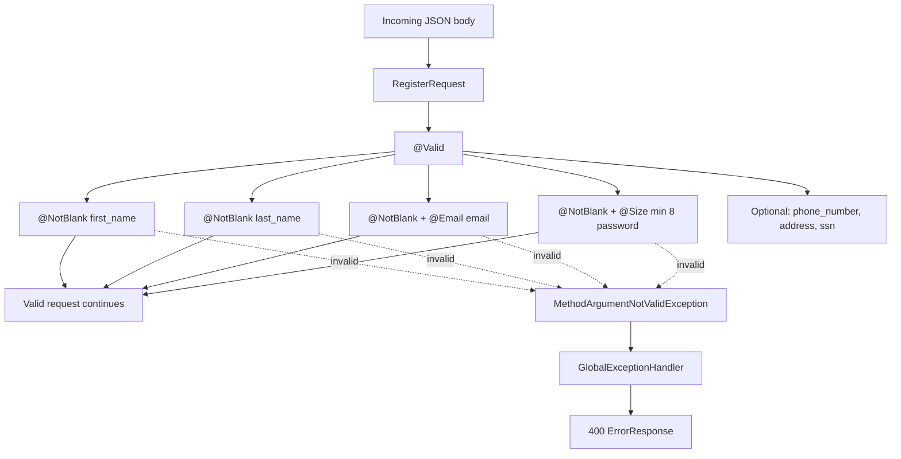

### Validation Rules

`RegisterRequest.java` defines the expected JSON fields and validation:

- `first_name`: required
- `last_name`: required
- `email`: required and must be an email
- `password`: required and must be at least 8 characters
- `phone_number`: optional
- `address`: optional
- `ssn`: optional

Spring automatically returns a validation error if these rules fail.

## Service Layer Flow

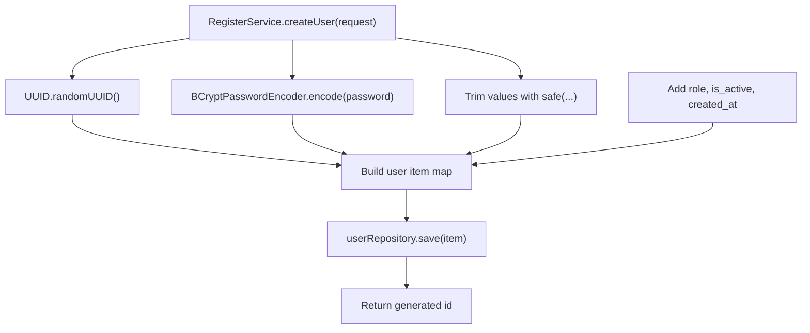

### `RegisterService.createUser()`

This method contains the main registration business logic.

It creates a user record with:

- `id`
- `first_name`
- `last_name`
- `address`
- `email`
- `phone_number`
- `social_security_number`
- `password_hash`
- `role`
- `is_active`
- `created_at`

It also hashes the password before saving, so the plaintext password is not stored.

## Repository and DynamoDB Flow

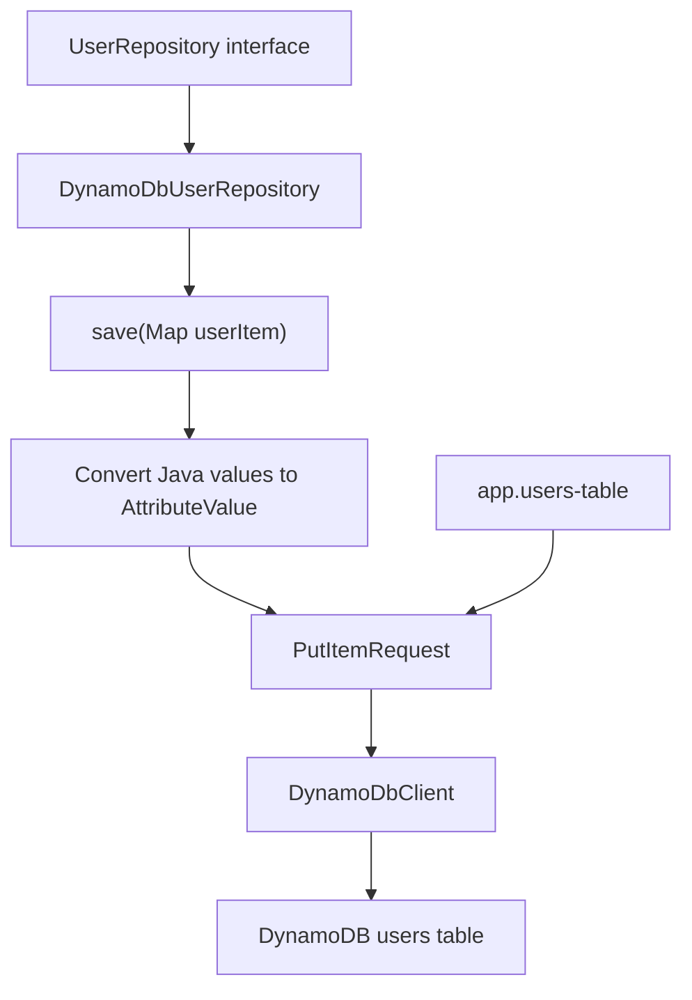

### Repository Design

`UserRepository` is an interface:

```java
void save(Map<String, Object> userItem);
```

`DynamoDbUserRepository` implements that interface and knows how to write to DynamoDB.

This is a professional pattern because the service depends on an abstraction (`UserRepository`) instead of directly depending on DynamoDB code. Later, you could add another repository implementation for tests or another database.

## AWS Configuration Flow

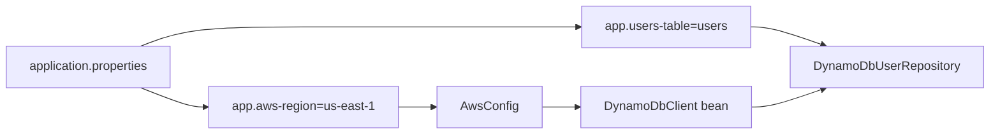

### Configuration

The Spring Boot app reads configuration from:

```text
src/main/resources/application.properties
```

Current values:

```properties
server.port=8080
app.users-table=users
app.aws-region=us-east-1
```

`AwsConfig.java` uses `app.aws-region` to create a `DynamoDbClient`.

`DynamoDbUserRepository.java` uses `app.users-table` to know which DynamoDB table to write to.

## Error Handling Flow

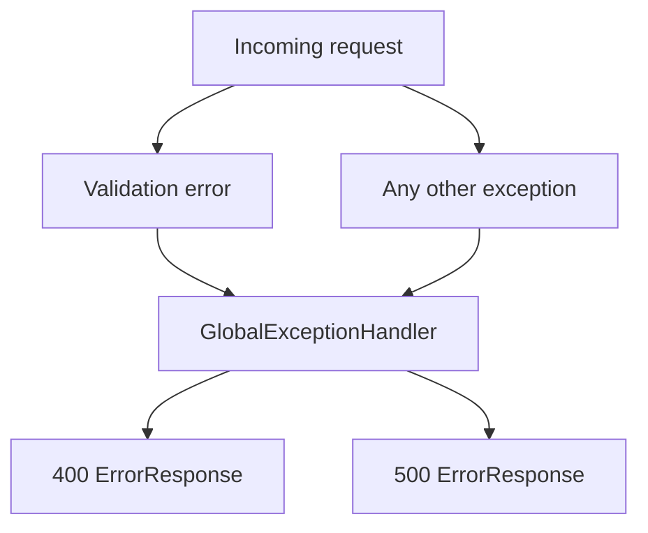

### `GlobalExceptionHandler`

`GlobalExceptionHandler.java` centralizes error responses.

It handles:

- `MethodArgumentNotValidException`: returns HTTP `400`
- generic `Exception`: returns HTTP `500`

The response body uses `ErrorResponse`:

```json
{
  "error": "message here"
}
```

## Dependency Map

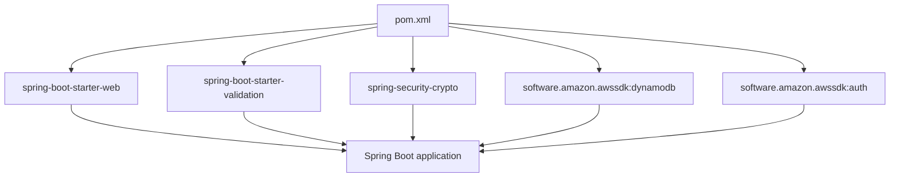

## Complete Responsibility Map

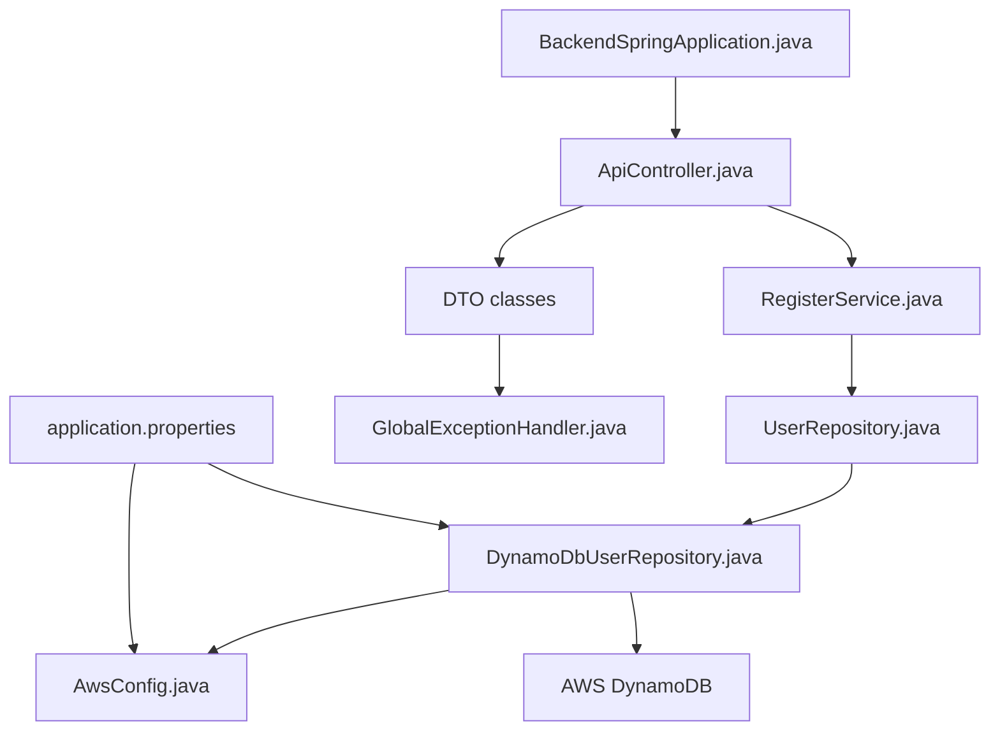

## How This Differs From the Node Serverless Backend

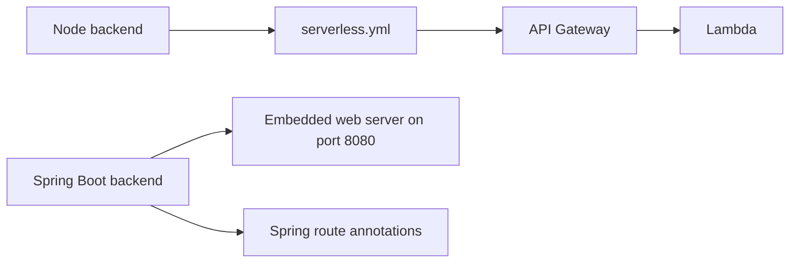

The Node backend uses `serverless.yml` to define API Gateway and Lambda. The Spring Boot backend defines endpoints in Java code using annotations and runs as a web application on port `8080`.

If you deploy Spring Boot to AWS later, you could run it on services such as:

- AWS App Runner
- ECS
- EKS / Kubernetes
- Elastic Beanstalk
- EC2

## Summary

The Spring Boot backend follows a layered architecture:

- `BackendSpringApplication.java` starts the app.
- `ApiController.java` exposes REST endpoints.
- DTO classes define request and response shapes.
- Jakarta validation checks incoming register data.
- `GlobalExceptionHandler.java` formats errors.
- `RegisterService.java` handles user creation logic.
- `UserRepository.java` defines the persistence contract.
- `DynamoDbUserRepository.java` writes users to DynamoDB.
- `AwsConfig.java` creates the AWS SDK DynamoDB client.
- `application.properties` controls port, table name, and region.

This is a professional Spring Boot structure because HTTP routing, validation, business logic, persistence, AWS configuration, and error handling are separated into clear layers.
