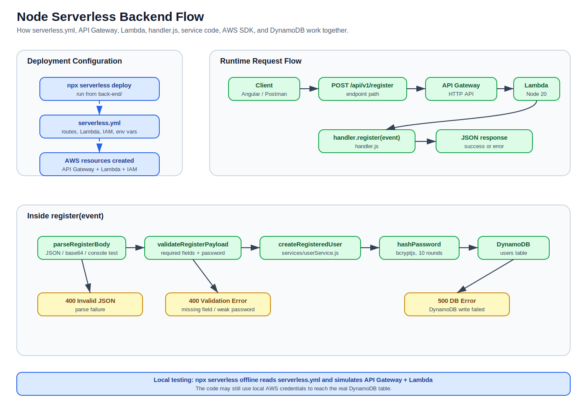
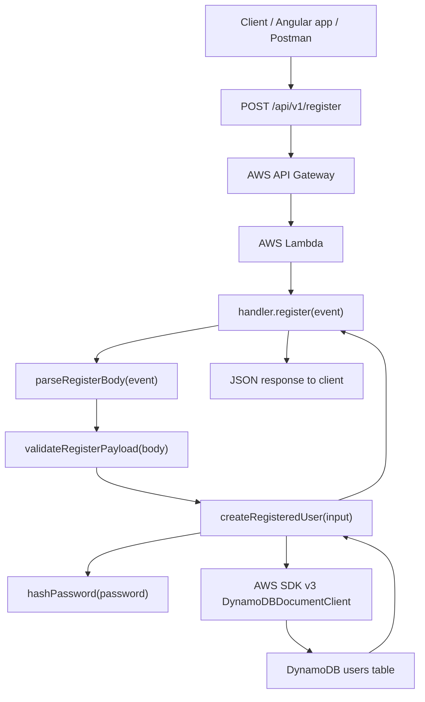
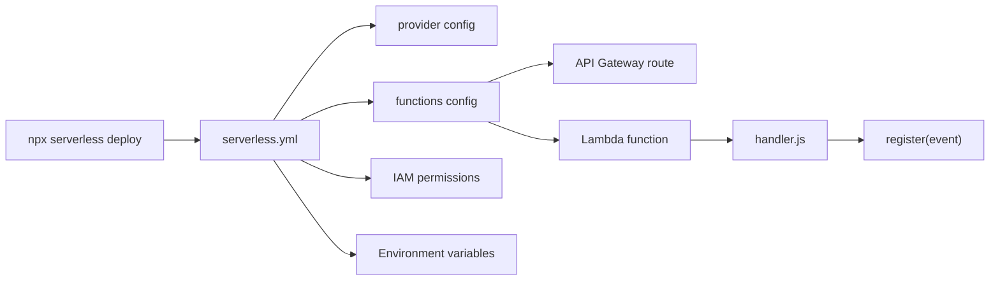
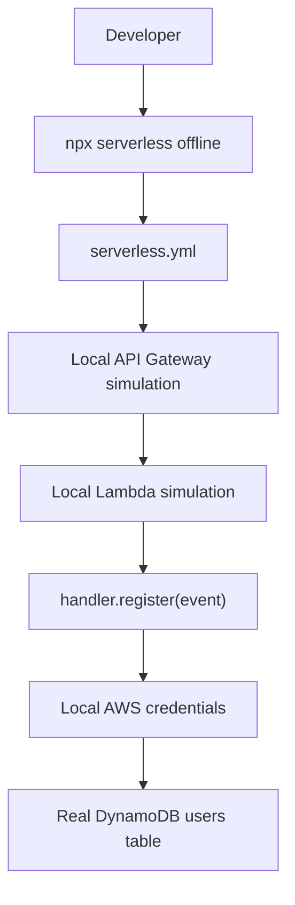
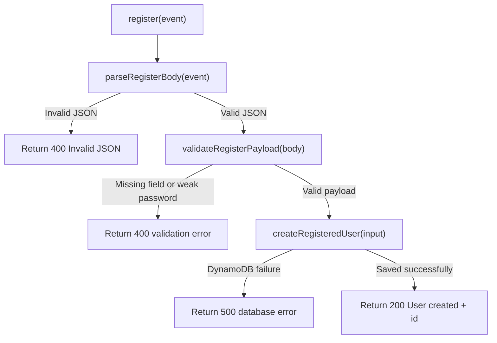
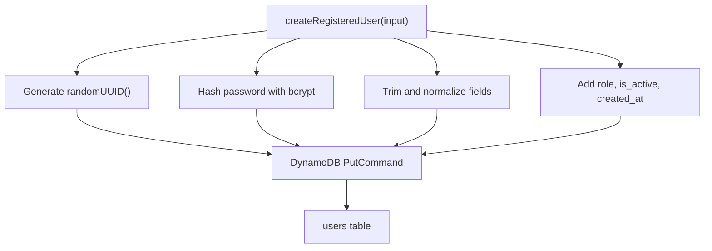
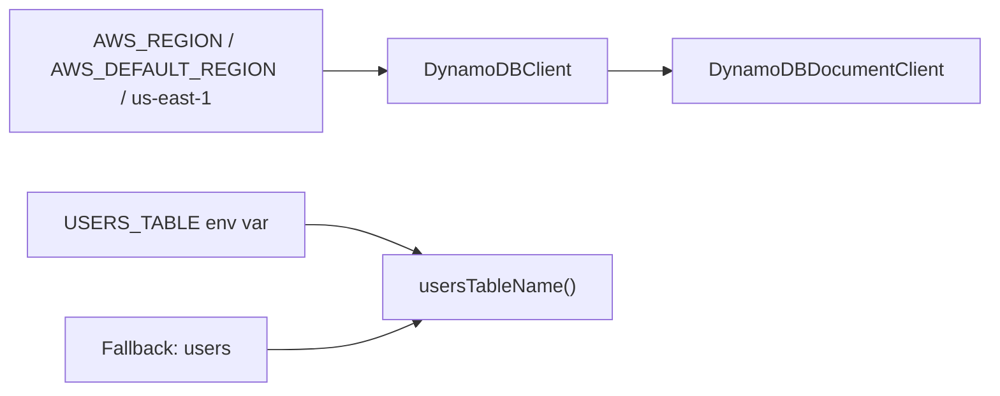
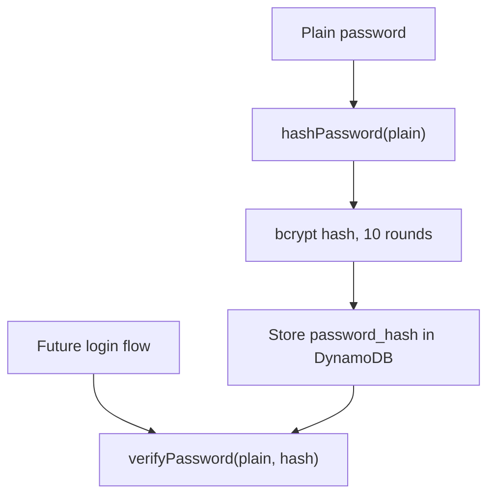
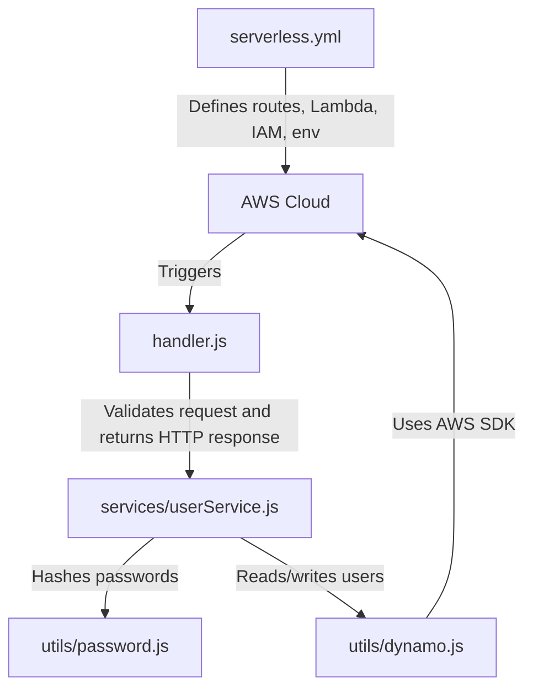

# Backend Serverless Flow Summary

This document explains how the `back-end/` folder works, how the API endpoint is created, and how a registration request flows through API Gateway, Lambda, the service layer, AWS SDK, and DynamoDB.

## Rendered Diagram

Use this image if Mermaid diagrams do not render in your Markdown preview:



## Main Files

- `back-end/serverless.yml`: deployment blueprint used by the Serverless Framework.
- `back-end/handler.js`: Lambda handler functions for API requests.
- `back-end/services/userService.js`: business logic for creating and reading users.
- `back-end/utils/dynamo.js`: DynamoDB client setup.
- `back-end/utils/password.js`: password hashing and verification helpers.
- `back-end/package.json`: dependencies and local scripts.

## High-Level Request Flow



### Flow Explanation

1. A client sends a `POST` request to `/api/v1/register`.
2. API Gateway receives the HTTP request.
3. API Gateway triggers the Lambda function created by Serverless.
4. Lambda runs `handler.register(event)` from `handler.js`.
5. The handler parses the incoming request body.
6. The handler validates required fields.
7. The handler calls `createRegisteredUser()` in `userService.js`.
8. The service hashes the password with bcrypt.
9. The service saves the user record to DynamoDB using the AWS SDK.
10. The handler returns a JSON response to the client.

## How `serverless.yml` Connects Everything



### What `serverless.yml` Does

`serverless.yml` is not called directly by your app code. It is read by the Serverless Framework when you run:

```bash
npx serverless deploy
```

Serverless uses it to create AWS resources:

- API Gateway HTTP routes
- Lambda functions
- IAM permissions
- environment variables
- runtime and region configuration

The important route definition is:

```yaml
register:
  handler: handler.register
  events:
    - httpApi:
        path: /api/v1/register
        method: post
```

This means:

```text
POST /api/v1/register -> API Gateway -> Lambda -> handler.register(event)
```

## Local Development Flow



When you run:

```bash
npx serverless offline
```

Serverless reads `serverless.yml` and starts a local HTTP server. This simulates API Gateway and Lambda on your machine. The code can still use your AWS credentials to talk to the real DynamoDB table unless you configure a local database.

## Registration Method Flow



### `register(event)`

`register(event)` is the Lambda handler for `POST /api/v1/register`.

It is responsible for API-level work:

- reading the request
- parsing JSON
- validating input
- calling the service layer
- returning HTTP responses

## User Service Flow



### `createRegisteredUser(input)`

This method contains the main business logic for registration.

It creates a DynamoDB item with:

- `id`
- `first_name`
- `last_name`
- `email`
- `phone_number`
- `address`
- `social_security_number`
- `password_hash`
- `role`
- `is_active`
- `created_at`

It uses `PutCommand` from `@aws-sdk/lib-dynamodb` to save the user.

## DynamoDB Utility Flow



### `utils/dynamo.js`

This file centralizes DynamoDB configuration.

It creates one shared `DynamoDBDocumentClient`, which is easier to use than the low-level DynamoDB client because it works with normal JavaScript objects.

The table name comes from:

```text
process.env.USERS_TABLE || "users"
```

The `USERS_TABLE` value is set by `serverless.yml`.

## Password Utility Flow



### `utils/password.js`

This file protects passwords by hashing them before storage.

- `hashPassword(plain)` hashes a new password.
- `verifyPassword(plain, hash)` can be used later for login.

The project currently uses password hashing during registration. Login verification is prepared but not yet exposed through an endpoint.

## Complete Backend Responsibility Map



## Summary

The backend follows a clean serverless architecture:

- `serverless.yml` defines the cloud infrastructure.
- API Gateway receives HTTP requests.
- Lambda runs `handler.register(event)`.
- `handler.js` handles API parsing and validation.
- `userService.js` contains user registration business logic.
- `password.js` hashes passwords securely.
- `dynamo.js` connects to DynamoDB through AWS SDK v3.
- DynamoDB stores the final user record.

This structure separates deployment configuration, API handling, business logic, database access, and security helpers into different files.
