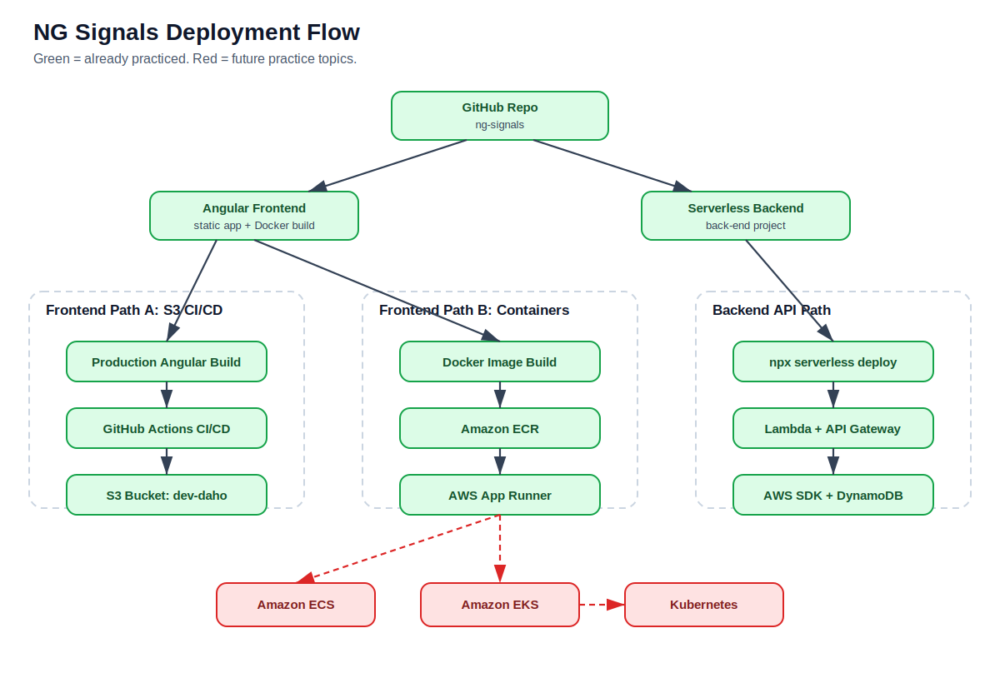
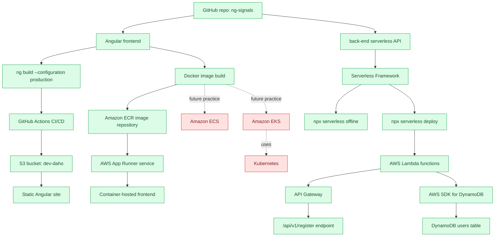
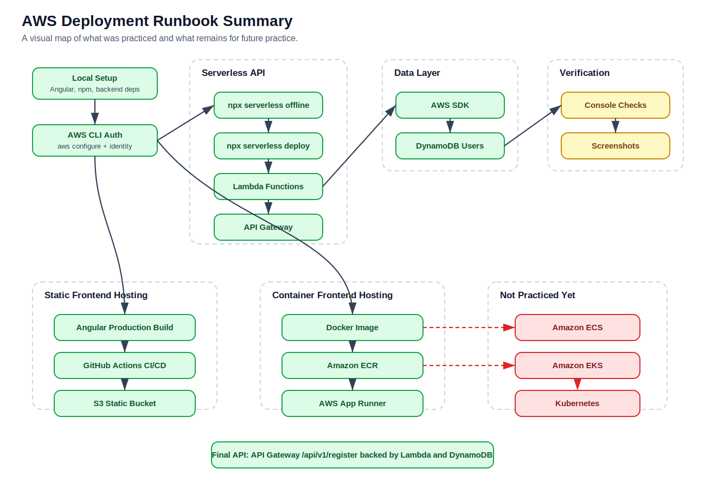
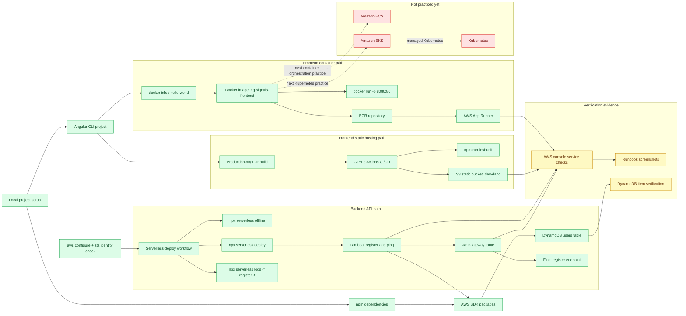

# NG Signals Project Summary

You built and deployed an Angular app with a serverless AWS backend, and you documented two valid frontend deployment paths.

## What You Built

- Created an Angular project called `ng-signals`.
- Added a backend in `back-end` using the Serverless Framework.
- Deployed the backend to AWS Lambda.
- Exposed the backend through API Gateway.
- Stored registered users in DynamoDB.
- Confirmed the final register endpoint:
  `https://9clpwaoipj.execute-api.us-east-1.amazonaws.com/api/v1/register`

## Frontend Deployment Paths

You tried two separate frontend deployment models:

- **S3 static hosting path**: GitHub Actions builds the Angular app, runs tests, and syncs `dist/ng-signals/browser` to the S3 bucket `dev-daho`.
- **Docker/App Runner path**: You built a Docker image for the frontend, pushed it to ECR, and ran it through AWS App Runner.

The important clarification is that S3 and Docker were separate approaches. You did not deploy a Docker image to S3. S3 received static Angular files, while ECR and App Runner handled the Docker image.

## Deployment Flow From README

Legend:

- Green = already practiced in this project.
- Red = not practiced yet, but useful next topics.

If Mermaid does not render in your Markdown preview, use this rendered SVG version:

## AWS Deployment Runbook Summary

If Mermaid does not render in your Markdown preview, use this rendered SVG version:

## AWS Services Used

You set up or touched these AWS services:

- DynamoDB
- Lambda
- API Gateway
- ECR
- App Runner
- S3
- IAM

## Documentation Purpose

The README and deployment runbook act as your personal AWS deployment memory. They capture the commands used, services touched, screenshots proving each step, and quick redeploy checklists for backend, S3 frontend, and Docker/App Runner frontend.

## Recommended Next Step

Choose one primary frontend deployment path to reduce confusion:

- Use **S3 + GitHub Actions** for simpler static hosting.
- Use **Docker + ECR + App Runner** if you want a container-based workflow.

The backend can remain Serverless/Lambda with either frontend approach.
